# HarvestIQ Product Overview

**A Comprehensive Construction Management Platform for Home Builders**

---

## Executive Summary

HarvestIQ is a full-featured, multi-tenant SaaS construction management platform designed specifically for home builders and construction companies. It provides end-to-end project management capabilities including scheduling, budgeting, contractor management, document storage, task tracking, and AI-powered assistance.

**Live Demo:** https://harvest-iq-rosy.vercel.app

---

## Table of Contents

1. [Key Features](#key-features)
2. [Screenshots & Feature Walkthrough](#screenshots--feature-walkthrough)
3. [Technical Architecture](#technical-architecture)
4. [Current Status](#current-status)
5. [Target Market](#target-market)
6. [Competitive Advantages](#competitive-advantages)
7. [SaaS Readiness Assessment](#saas-readiness-assessment)

---

## Key Features

### Core Functionality

| Feature | Description | Status |
|---------|-------------|--------|
| **Multi-Tenant Architecture** | Each builder company has isolated data with their own users, organizations, and projects | Complete |
| **Capital Exposure (Primary)** | Intelligence layer surfacing where time and money are at risk - the default landing page and command center | Complete |
| **Required Interventions** | Ranked action items with recommended interventions and capital impact | Complete |
| **Industry Benchmarks** | Compare project performance against NAHB/RSMeans industry standards | Complete |
| **Projects (Evidence)** | Track construction projects with status - evidence supporting risk analysis | Complete |
| **Schedule (Evidence)** | Phases, tasks, milestones, dependencies - evidence for schedule risk | Complete |
| **Budget (Evidence)** | Categories, line items, variance analysis - evidence for budget risk | Complete |
| **Contractors (Resources)** | Track contractors, specialties, availability, and project assignments | Complete |
| **Document Storage** | Upload and organize contracts, permits, blueprints via Cloudflare R2 | Complete |
| **Tasks (Evidence)** | Task items with priorities, due dates - evidence for intervention tracking | Complete |
| **Team (Resources)** | Organizations, member roles (admin/manager/member/viewer), invitations | Complete |
| **Alerts (Resources)** | One-time and recurring alerts with notifications | Complete |
| **AI Assistant - Jostin (Resources)** | Context-aware chat for project queries, budget analysis, schedule insights | Complete |
| **Activity Logging** | Full audit trail of all actions across the platform | Complete |
| **Notifications** | In-app notifications with granular preferences | Complete |

### Authentication & Security

- Email/password authentication with email verification
- JWT access tokens (15 min) + HTTP-only refresh tokens (7 days)
- Password reset flow via email
- Account lockout after failed attempts
- Rate limiting on all endpoints
- Role-based access control (RBAC)

---

## Screenshots & Feature Walkthrough

### 1. Landing Page

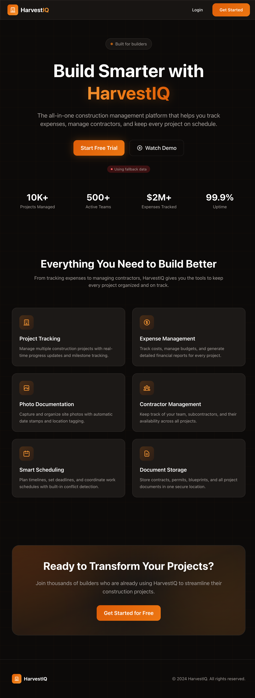

The landing page showcases HarvestIQ's value proposition with:
- Clear messaging for construction professionals
- Feature highlights (Project Tracking, Expense Management, Photo Documentation, etc.)
- Call-to-action for free trial signup
- Backend connectivity status indicator

### 2. Authentication

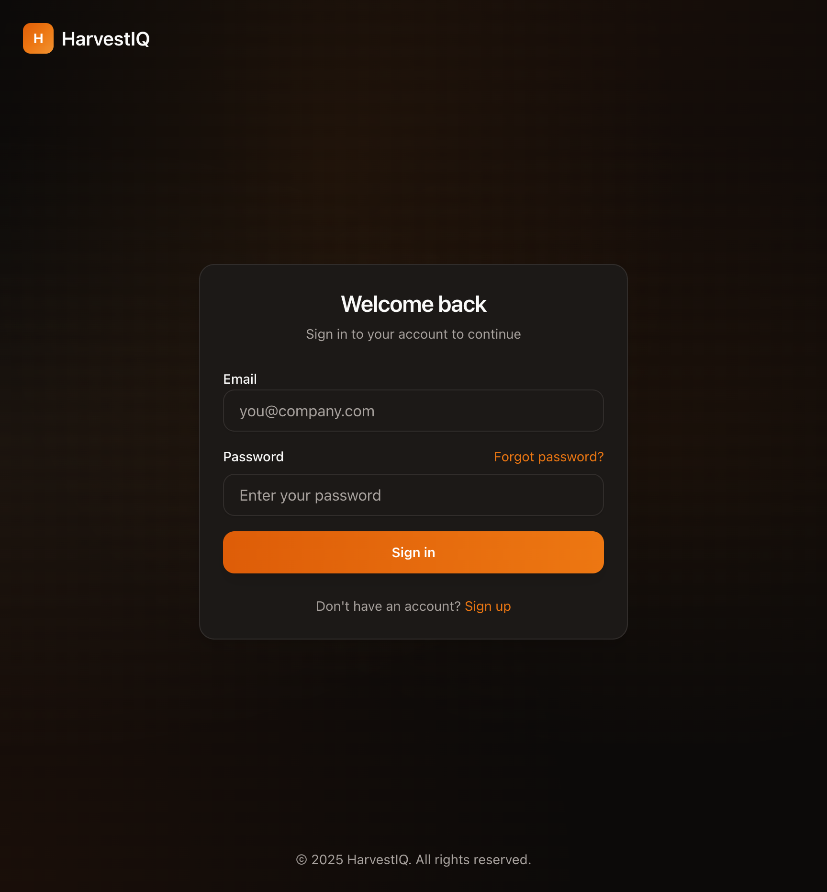

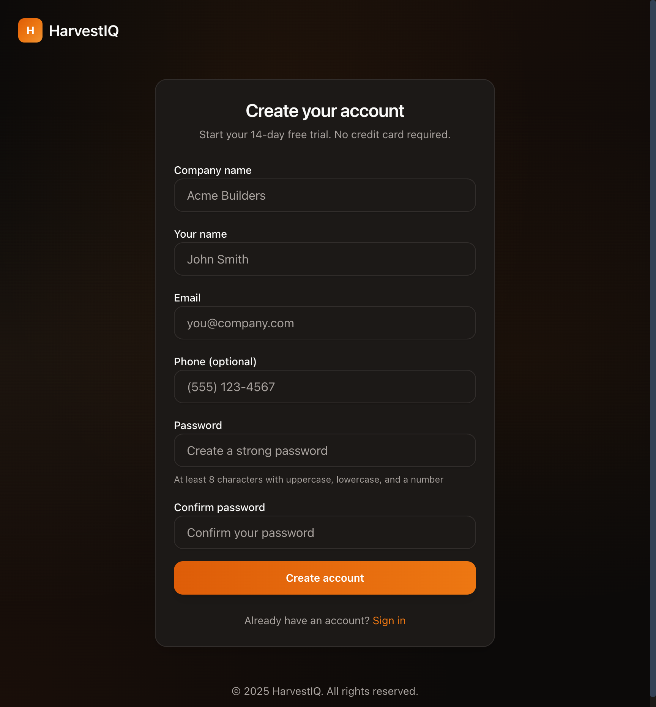

**Features:**
- Clean, professional login/registration forms
- 14-day free trial, no credit card required
- Email verification flow
- Password reset functionality

### 3. Capital Exposure (Default Landing Page / Command Center)

Capital Exposure is the primary interface and default landing page - the command center that answers: **"Where do I need to intervene right now to protect time and capital?"**

**UI Philosophy:**
- **Primary (Capital Exposure):** The command center where intervention happens
- **Evidence (Projects, Schedule, Tasks):** Supporting data that explains the risk
- **Resources (Contractors, Team, Alerts, Jostin):** Supporting operations

**Portfolio Summary:**
- Total Capital at Risk across all active projects
- Risk distribution breakdown (Critical, High, Medium, Low)
- Portfolio Exposure Level with visual indicator

**Project Risk Overview Table:**
- All projects ranked by composite risk score
- Schedule and budget risk scores with visual progress bars
- Capital at risk per project
- Trend indicators (improving, stable, worsening)
- Quick issue badges (overdue tasks, blocked tasks, over budget)

**Required Interventions Panel:**
- Ranked list of actions requiring attention
- Severity levels with color coding
- Capital and schedule impact for each intervention
- One-click acknowledgment

**Project Risk Detail Page:**
- Composite, schedule, and budget risk gauges
- Detailed metrics (overdue tasks, phase delays, milestone slippage)
- Budget vs industry benchmark comparison table
- Required interventions for the project

**Risk Calculation System:**
- Schedule Risk (0-100): Overdue tasks, blocked tasks, phase delays, milestone slippage
- Budget Risk (0-100): Variance, over-budget categories, burn rate deviation, cost per unit
- Composite Score: Weighted combination with trend modifiers
- Risk Levels: Critical (>=75), High (>=50), Medium (>=25), Low (<25)

**Industry Benchmarks:**
- Phase duration benchmarks by unit type (single family, townhomes, condos)
- Budget category percentages from NAHB/RSMeans standards
- Builder-specific learned benchmarks from completed projects

**Predictive ARV (After Repair Value):**
- AI-powered property value prediction at project completion
- Real-time market data from FRED API (Housing Price Index)
- State-level and national appreciation rates
- Confidence scoring with reasoning
- Compare predicted ARV to target ARV
- Portfolio-level forecasted gain/loss analysis

### 4. Overview Dashboard (Secondary)

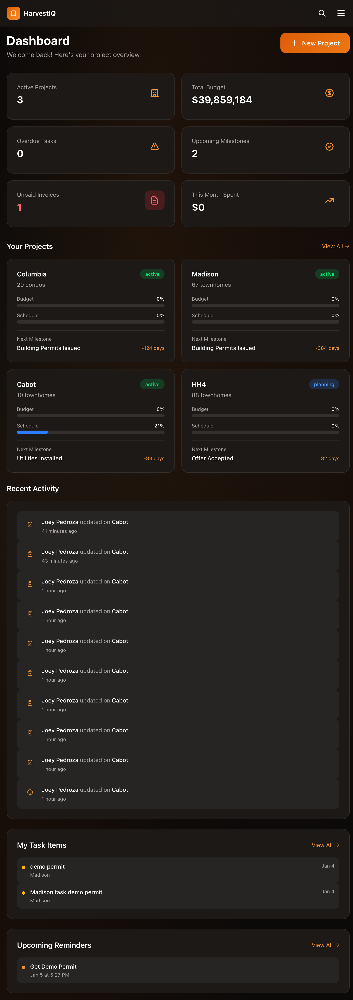

The overview dashboard provides supplementary metrics (accessible via `/dashboard` but removed from primary navigation in favor of Capital Exposure):
- **Key Metrics:** Active projects, total budget, overdue tasks, upcoming milestones
- **Project Cards:** Quick view of all projects with budget/schedule progress
- **Recent Activity:** Live feed of team actions
- **My Task Items:** Personal task list
- **Upcoming Alerts:** Scheduled notifications

### 5. Projects

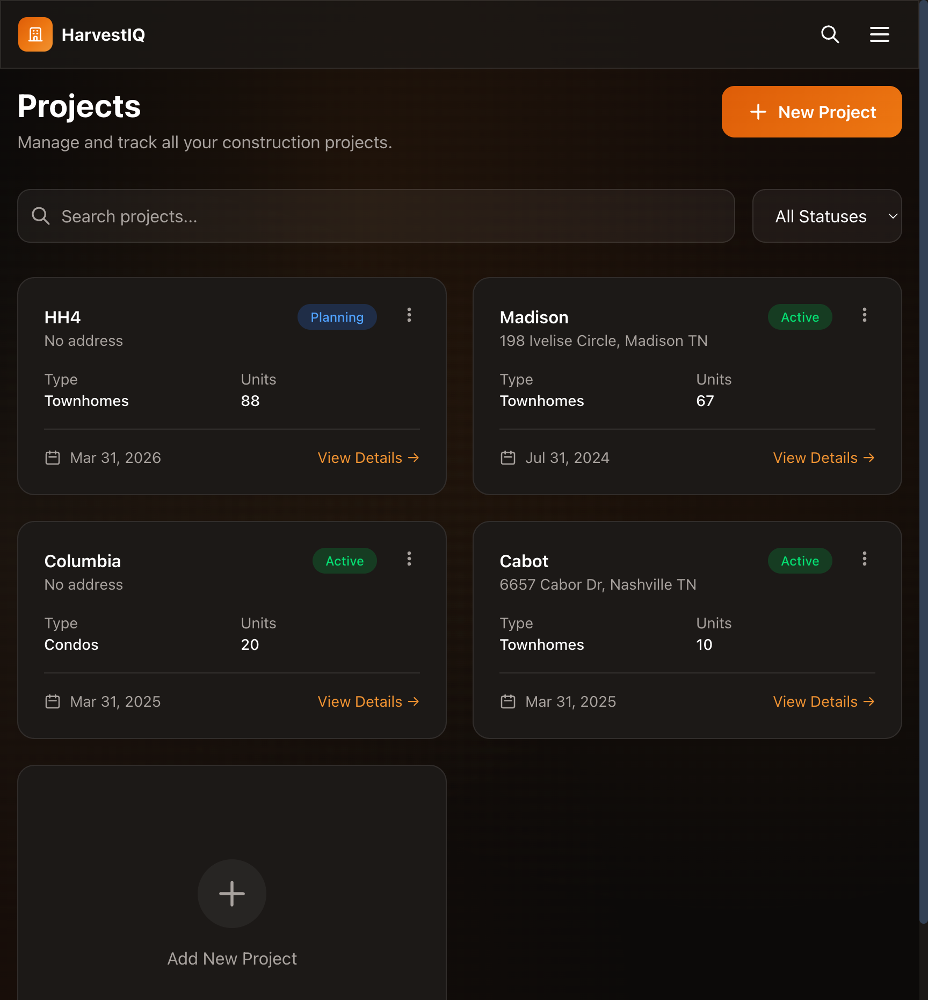

**Project List Features:**
- Grid view of all projects
- Filter by status (Planning, Active, On Hold, Completed)
- Search functionality
- Quick stats (unit type, number of units, dates)
- Easy navigation to project details

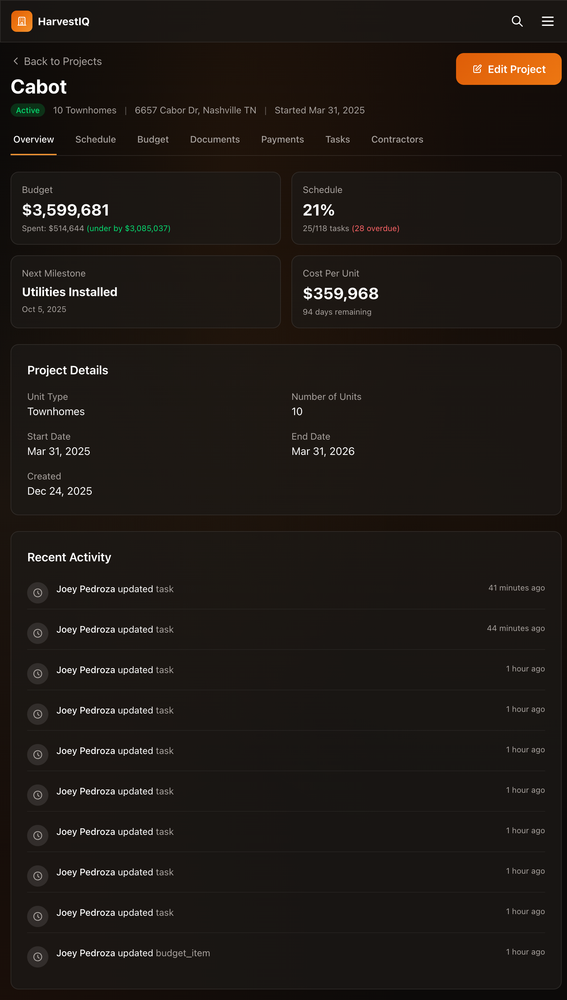

**Project Overview Features:**
- Budget summary with variance tracking
- Schedule progress percentage
- Next milestone with countdown
- Cost per unit calculation
- Recent activity feed

### 6. Schedule Management

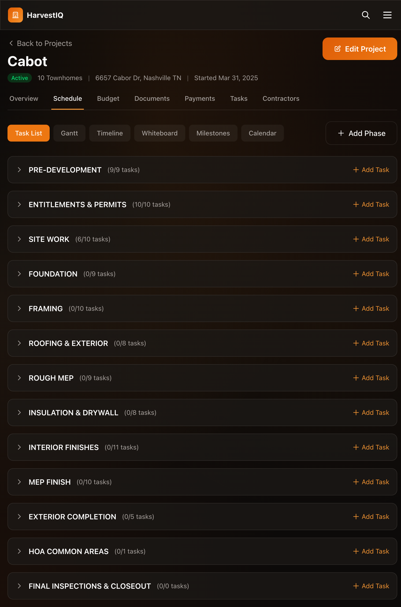

**Schedule Features:**
- Multiple view options: Task List, Gantt, Timeline, Whiteboard, Milestones, Calendar
- Construction phases (Pre-Development, Site Work, Foundation, Framing, etc.)
- Task count per phase with progress indicators
- Add phases and tasks directly

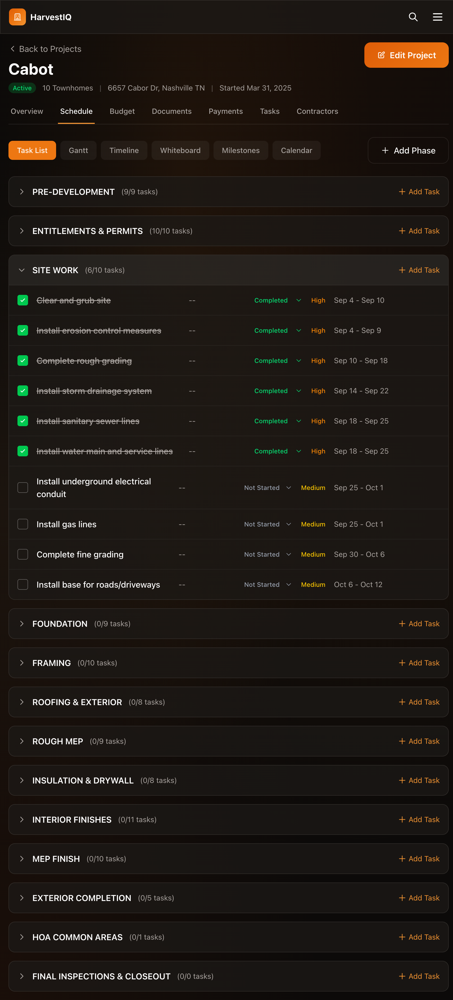

**Task List Features:**
- Expandable phases showing all tasks
- Status management (Not Started, In Progress, Completed, Blocked)
- Priority levels (Low, Medium, High, Urgent)
- Planned date ranges
- Assignee tracking
- Progress tracking with quantity-based completion (e.g., 6/10 foundations poured)
- Inline editing and deletion

### 7. Budget Management

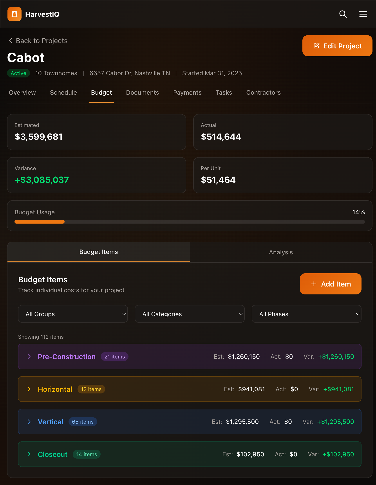

**Budget Features:**
- Summary cards: Estimated, Actual, Variance, Per Unit costs
- Budget usage percentage with visual indicator
- Grouped by construction phase (Pre-Construction, Horizontal, Vertical, Closeout)
- 30+ budget categories (Appliances, Electrical, Framing, HVAC, etc.)
- 100+ pre-populated line items
- Filter by group, category, or phase
- Analysis view for spending insights

### 8. Contractor Management


**Contractor Features:**
- Contractor profiles with specialty and contact info
- Status tracking (Available, On Project, Unavailable)
- Project assignments with multi-project support
- Rating system
- Search and filter by specialty/status
- Quick add/edit/delete actions

### 9. AI Assistant (Jostin)

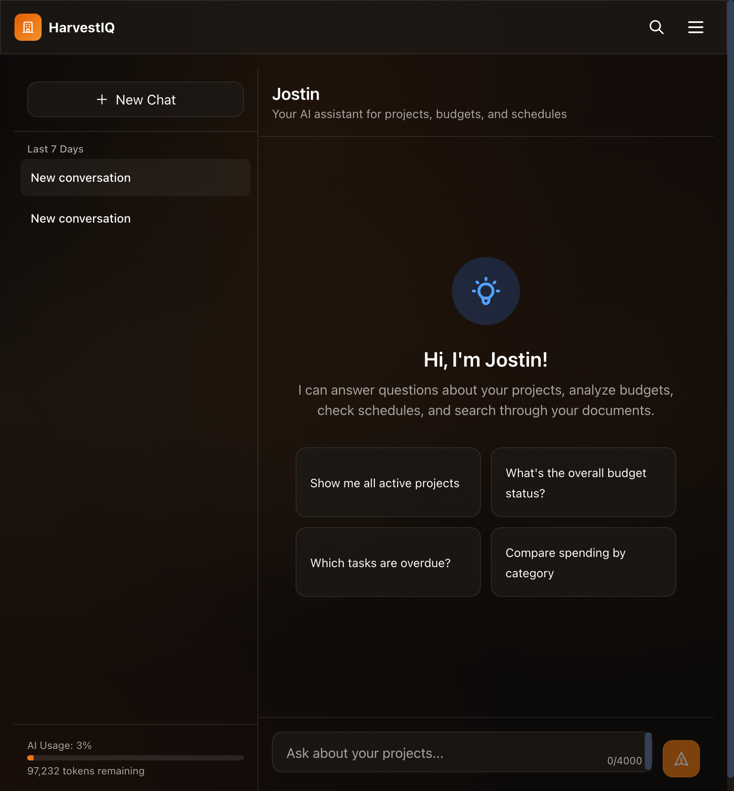

**AI Features:**
- Context-aware conversation about your projects
- Budget analysis and spending insights
- Schedule queries and progress checks
- Document search across uploaded files
- Conversation history
- Usage tracking with monthly limits

### 10. Task Management

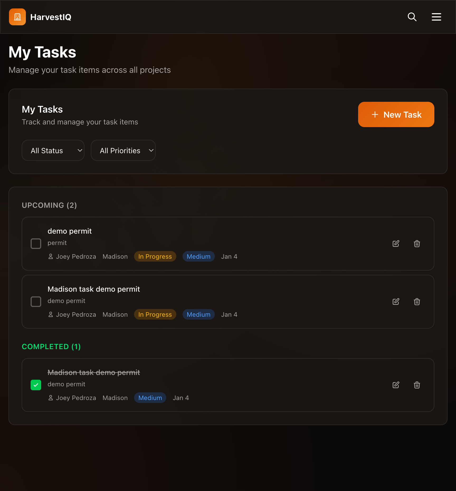

**Task Features:**
- Cross-project task view
- Filter by status and priority
- Create tasks with project assignment
- Due date tracking
- Assignee management

### 11. Team Management

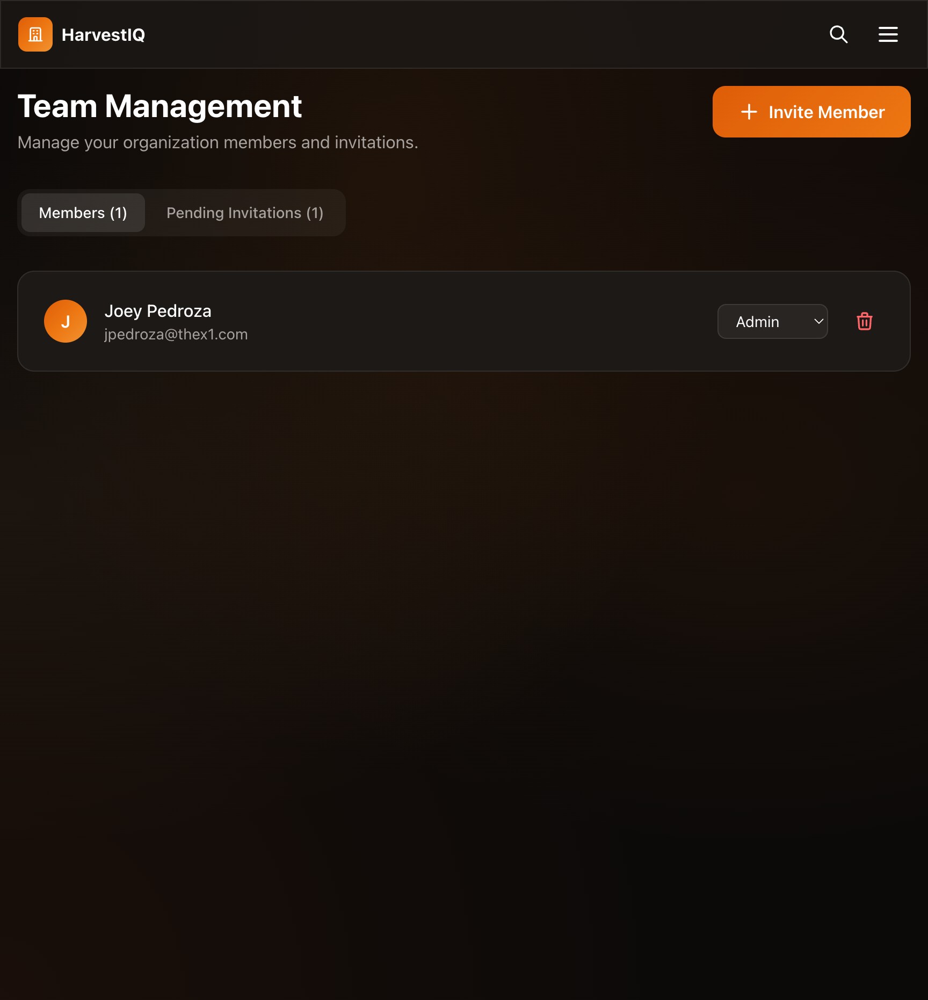

**Team Features:**
- Organization member management
- Role-based permissions (Admin, Manager, Member, Viewer)
- Email invitations with secure tokens
- Pending invitation tracking
- Member removal and role changes

---

## Technical Architecture

### Stack Overview

```
Frontend (Vercel)          Backend (Railway)           Storage
┌─────────────────┐       ┌─────────────────┐       ┌─────────────────┐
│   Next.js 15    │──────▶│   Express.js 5  │──────▶│   PostgreSQL    │
│   React 19      │       │   TypeScript    │       │   (Railway)     │
│   Tailwind CSS  │       │   JWT Auth      │       └─────────────────┘
│   shadcn/ui     │       │   Zod Validation│              │
└─────────────────┘       └────────┬────────┘              │
                                   │                       │
                          ┌────────┴────────┐              │
                          │                 │              │
                          ▼                 ▼              │
                 ┌─────────────────┐ ┌─────────────────┐   │
                 │  Cloudflare R2  │ │     Resend      │   │
                 │  (File Storage) │ │  (Email API)    │   │
                 └─────────────────┘ └─────────────────┘   │
                          │                                │
                          ▼                                │
                 ┌─────────────────┐                       │
                 │   Claude API    │◀──────────────────────┘
                 │   (AI Chat)     │
                 └─────────────────┘
```

### Database Schema

- **45+ tables** covering all functionality
- Multi-tenant isolation via `builder_id` on all tables
- Soft deletes for data recovery
- Full audit logging
- Risk management tables: industry_benchmarks, budget_category_benchmarks, project_risk_metrics, risk_interventions, project_outcomes, builder_benchmarks
- Property valuation fields: purchase_price, appraised_value, target_arv, predicted_arv, valuation_date

### External Integrations

| Service | Purpose |
|---------|---------|
| Claude API | AI-powered chat and ARV predictions |
| FRED API | Housing Price Index market data |
| OpenAI | Document embeddings for semantic search |
| Resend | Transactional email |
| Cloudflare R2 | Document storage |

### API

- **150+ REST endpoints** across all resources
- Zod schema validation on all inputs
- Consistent error handling and response formats
- Rate limiting per endpoint type
- Risk API: dashboard, project risk details, interventions, recalculation

---

## Current Status

### Development Phases (All Complete)

| Phase | Features | Status |
|-------|----------|--------|
| Phase 1 | Infrastructure & Authentication | Complete |
| Phase 2 | Core Models (Projects, Organizations) | Complete |
| Phase 3 | Schedule & Budget | Complete |
| Phase 4 | Documents & Payments | Complete |
| Phase 5 | Tasks & Notifications | Complete |
| Phase 6 | Dashboard & Reports | Complete |
| Phase 7 | AI Integration | Complete |
| Phase 8 | Capital Risk Intelligence | Complete |

### Production Environment

- **Frontend:** Deployed on Vercel with automatic GitHub deployments
- **Backend:** Deployed on Railway with PostgreSQL
- **Storage:** Cloudflare R2 for documents
- **Email:** Resend for transactional emails
- **Uptime:** 99.9%+ availability

---

## Target Market

### Primary Audience

1. **Small to Medium Home Builders** (5-50 projects/year)
   - Need affordable project management
   - Want to replace spreadsheets and paper
   - Value simplicity over complex enterprise tools

2. **Construction Project Managers**
   - Managing multiple projects simultaneously
   - Need schedule and budget visibility
   - Coordinate with subcontractors

3. **Custom Home Builders**
   - Client-facing progress updates
   - Detailed cost tracking per unit
   - Document management for permits/contracts

### Market Size

- ~700,000 home builder businesses in the US
- Construction management software market: $2.5B (2024), growing 10%+ annually
- Underserved segment: Small builders using spreadsheets or outdated tools

---

## Competitive Advantages

| Feature | HarvestIQ | Buildertrend | CoConstruct | Procore |
|---------|-----------|--------------|-------------|---------|
| **Capital Exposure Intelligence** | Yes | No | No | No |
| **Intervention-First Design** | Yes | No | No | No |
| **Predictive ARV Forecasting** | Yes | No | No | No |
| **AI Assistant** | Yes | No | No | Limited |
| **Industry Benchmarks** | Yes | No | Limited | No |
| **Market Data Integration** | Yes | No | No | No |
| **Price Point** | Affordable | $$$ | $$$ | $$$$ |
| **Setup Time** | Minutes | Days | Days | Weeks |
| **Learning Curve** | Low | Medium | Medium | High |
| **Multi-Unit Focus** | Yes | Limited | Yes | Enterprise |
| **Modern UI** | Yes | Dated | Dated | Complex |

### Unique Selling Points

1. **Intervention-First Design:** Capital Exposure as the command center - not observation, but action
2. **Capital Exposure Intelligence:** Proactive risk identification with ranked interventions and capital impact analysis
3. **Predictive ARV Forecasting:** AI-powered property value predictions using real-time market data from FRED API, with confidence scoring and reasoning
4. **AI-Powered Insights:** Jostin provides intelligent analysis of budgets, schedules, and documents
5. **Industry Benchmarks:** Compare performance against NAHB/RSMeans standards, learn from your own completed projects
6. **Market Data Integration:** Real-time Housing Price Index data for state-level and national appreciation rates
7. **Construction-Specific Templates:** Pre-built phases and budget categories for residential construction
8. **Quantity-Based Progress:** Track completion by units (e.g., 6/10 foundations poured)
9. **Clean, Modern Interface:** Built with latest web technologies
10. **Affordable Pricing:** Designed for small/medium builders, not enterprise pricing

---

## SaaS Readiness Assessment

### Ready for Launch

| Criteria | Status | Notes |
|----------|--------|-------|
| Core Features Complete | Yes | All 7 phases implemented |
| Production Deployed | Yes | Live on Vercel/Railway |
| Authentication Secure | Yes | JWT, email verification, rate limiting |
| Multi-Tenant Isolation | Yes | Builder-level data separation |
| Email Integration | Yes | Resend for transactional emails |
| File Storage | Yes | Cloudflare R2 |
| Mobile Responsive | Partial | Works on mobile, not optimized |
| API Documentation | Yes | 137 documented endpoints |

### Recommended Before Commercial Launch

| Item | Priority | Effort |
|------|----------|--------|
| Stripe/Payment Integration | High | 1-2 weeks |
| Subscription Management | High | 1-2 weeks |
| Onboarding Flow | Medium | 1 week |
| Mobile App or PWA | Medium | 4-6 weeks |
| Help Documentation | Medium | 1 week |
| Terms of Service / Privacy Policy | High | Legal review |
| GDPR/Data Handling Compliance | Medium | Audit needed |
| Performance Optimization | Low | Ongoing |
| Automated Testing Suite | Low | 2-3 weeks |

### Estimated Time to Market

**With current state:** 2-4 weeks for payment integration and legal documents

---

## Conclusion

HarvestIQ is a **production-ready** construction intervention platform with comprehensive features covering the full lifecycle of residential construction projects. The core product is complete and deployed, with a clean architecture that can scale.

**Strengths:**
- Capital Exposure as the command center - intervention-first design that answers "Where do I intervene to protect time and capital?"
- Evidence-based architecture: Projects, Schedule, Tasks feed into risk analysis
- Modern, intuitive UI with clear hierarchy (Primary → Evidence → Resources)
- Complete feature set across 8 development phases
- AI-powered assistance (Jostin)
- Industry benchmarks with builder-specific learning
- Multi-tenant architecture
- Production deployed

**Next Steps for SaaS Launch:**
1. Implement Stripe for billing
2. Add subscription tiers (Free, Starter, Pro, Enterprise)
3. Legal documents (ToS, Privacy Policy)
4. Marketing website refinement
5. Beta user onboarding

**Recommendation:** The product is ready for beta users and early adopters. Payment integration is the primary blocker for commercial launch.
